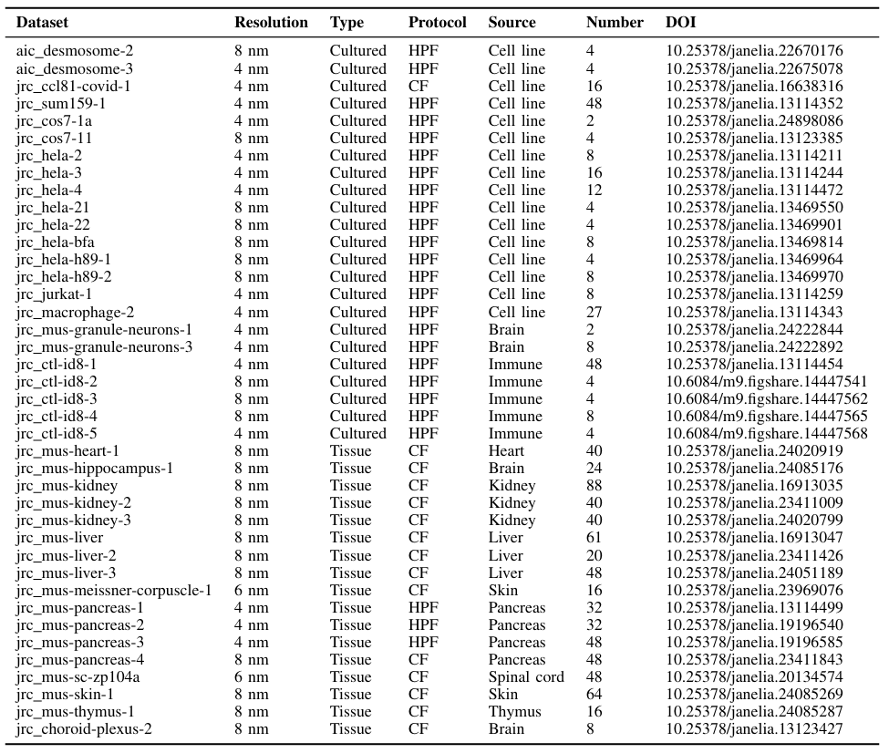
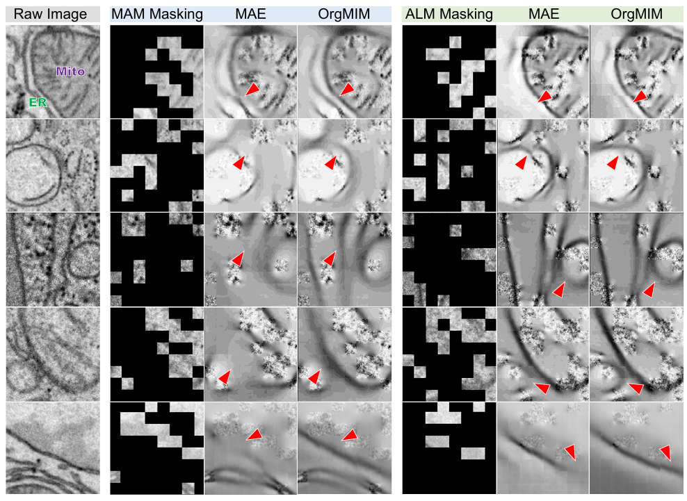

# OrgMIM

Datasets, codes, and pretrained weights for **“Masked Image Modeling for Generalizable Organelle Segmentation in Volume EM”** *(under review)*

## 1. Pretraining Database: IsoOrg-1K

We introduce **IsoOrg-1K**, a diverse organelle-specific dataset collected from [OpenOrganelle](https://openorganelle.janelia.org/). Detailed information is shown below. The full dataset (and the metadata) can be accessed [here](https://drive.google.com/drive/folders/13ybWYaCtwuRcRfhyEZ-_mY8fVUBFgGKS?usp=sharing), and the precomputed membrane maps are available [here](https://huggingface.co/datasets/yanchaoz/IsoOrg-1K).
Meanwhile, we are actively curating and integrating organelle datasets, and will continue to update this repository to support larger-scale pretraining in the future.


## 2. Downstream Segmentation Datasets

We conduct extensive experiments on six representative datasets with varying voxel resolutions and biological contexts. The processed and partitioned data can be downloaded from [here](https://huggingface.co/datasets/yanchaoz/IsoOrg-1K).

## 3. Environments

The complete Conda environment has been packaged for direct use. You can download and unzip it from [here](https://huggingface.co/yanchaoz/OrgMIM).

## 4. Pretraining via OrgMIM

### 4.1 Generation of membrane attention maps
#### Step 1. Loading a Visual Foundation Model
First, install the [Segment Anything](https://github.com/facebookresearch/segment-anything) package:

```bash
pip install git+https://github.com/facebookresearch/segment-anything.git
```
Then, load the SAM model and weights in Python:
```python
from segment_anything import sam_model_registry, SamPredictor

# Available model types: "vit_h", "vit_l", "vit_b"
model_type = "vit_h"
checkpoint_path = "sam_vit_h_4b8939.pth"

# Download the checkpoint from the official GitHub:
# https://github.com/facebookresearch/segment-anything#model-checkpoints

sam = sam_model_registry[model_type](checkpoint=checkpoint_path)

```
#### Step 2. Pixel-level Similarity Calcuation
```python
# Load a single-channel TIFF image and convert it to 3-channel RGB
img = tiff[i, :, :]
img_rgb = np.stack([img] * 3, axis=0)  # Shape: (3, H, W)
image = np.transpose(img_rgb, (1, 2, 0))  # Shape: (H, W, 3)

# Initialize SAM predictor and extract features
predictor = SamPredictor(sam)
predictor.set_image(image)
embedding = predictor.features
embedding = embedding.detach().cpu().numpy().squeeze()  # Shape: (C, H, W)

# Compute pixel affinities from embeddings
affs = embeddings_to_affinities(embedding, delta_v=0.5, delta_d=1.5)
affs = np.minimum(affs[0], affs[1])  # Take element-wise min of first two channels
affs = affs[1:, 1:]

# Resize affinity map to desired shape
affs_resized = nearest_neighbor_resize(affs, (512, 512))

# Convert affinity map to uint8 format for saving or visualization
affs_uint8 = np.uint8(255 * affs_resized)
```

| Function / Class             | Defined In           | Description                                      |
|-----------------------------|----------------------|--------------------------------------------------|
| `embeddings_to_affinities`  | `preparation/mam_utils.py`  | Converts pixel embeddings into affinity maps     |
| `nearest_neighbor_resize`   | `preparation/mam_utils.py`     | Resizes 2D arrays using nearest neighbor interpolation |

### 4.2 Dual-branch masked image modeling

After downloading the dataset, simply run the following script to start training MAE/SparK-based OrgMIM:

```bash
cd orgmim_mae 
python /pretrain_orgmim.py --config configs/orgmim.yaml
```
```bash
cd orgmim_spark
python /pretrain_orgmim.py --config configs/orgmim.yaml
```

## 5. Downstream Finetuning
<!---All downstream fine-tuning experiments were conducted within the nnU-Net framework. -->
Process downstream datasets are available [here](https://huggingface.co/datasets/yanchaoz/IsoOrg-1K). Notably, the input data are normalized by dividing pixel intensities by **255.0**.

### Pretrianed weights transfer on STU-Net (CNN-based)
```python
import torch
from collections import OrderedDict

# Initialize network
self.network = STUNet(
    self.num_input_channels,
    self.num_classes,
    depth=[1, 1, 1, 1, 1, 1],
    dims=[32, 64, 128, 256, 512, 512],
    pool_op_kernel_sizes=self.net_num_pool_op_kernel_sizes,
    conv_kernel_sizes=self.net_conv_kernel_sizes
)

# Load pretrained model weights
saved_model = torch.load('/***/***/orgmim_spark_b_learner.ckpt')
pretrained_dict = saved_model['model_weights']

# Process and load encoder weights into the current model
new_dict = OrderedDict()
for old_key, value in pretrained_dict.items():
    if 'encoder' in old_key:
        new_key = old_key.split('sp_cnn.')[-1]
        new_dict[new_key] = value

self.network.load_state_dict(new_dict, strict=False)
```
### Pretrianed weights transfer on UNETR (ViT-based)
```python
# Initialize network
self.network =  UNETR(
                in_channels=self.num_input_channels,
                out_channels=self.num_classes,
                img_size=(128, 128, 128),
                patch_size=(16, 16, 16),
                feature_size=16,
                hidden_size=768,
                mlp_dim=3072,
                num_heads=12,
                norm_name='instance',
                conv_block=True,
                res_block=True,
                kernel_size=3,
                skip_connection=False,
                show_feature=False,
                dropout_rate=0.0)

# Load pretrained model weights
saved_model = torch.load('/***/***/orgmim_mae_b_learner.ckpt')
vit_state_dict = checkpoint['model_weights']
self.network.vit.load_state_dict(vit_state_dict, strict=False)
```
## 6. Visualization
### Mask reconstruction by directly loading the pretrained MIM learner
```python
model = ViT(
    image_size=128,
    frames=128, 
    image_patch_size=16,  
    frame_patch_size=16, 
    channels=1,
    dim=768,
    depth=12,
    heads=12,
    mlp_dim=3072,
    dropout=0.1,
    emb_dropout=0.1
)

learner = MAE(
    encoder=model,
    masking_ratio=0.75,
    decoder_dim=512,
    decoder_depth=6,
)

ckpt_path_list = ['/***/***/orgmim_mae_b_learner.ckpt']
img_path = '/opt/data/.../input/image.tif'
att_path = '/opt/data/.../input/mam.tif'
save_dir = '/opt/data/.../output'
name_list = ['dual']

reconstruct_and_visualize(
    learner=learner,
    ckpt_paths=ckpt_path_list,
    img=img,
    att=mam,
    device=device,
    save_dir=save_dir,
    name_list=name_list,
    mask_ratio=0.75,
    step=200000,
    total_step=400000,
    patch_size=16,
    image_size=128,
    alpha_t=1
)
```
    
| Function / Class             | Defined In           | Description                                      |
|-----------------------------|----------------------|--------------------------------------------------|
| `reconstruct_and_visualize`   | `/orgmim_mae/visualize.py`     | Load pretrained weights and reconstruct the masked input |

## 7. Released Weights

| Methods                   | Models                        | Download                                                      |
|----------------------------|-------------------------------|---------------------------------------------------------------|
| MAE-based OrgMIM (Base)    | orgmim_mae_b_learner.ckpt     | [Hugging Face](https://huggingface.co/yanchaoz/OrgMIM)       |
| Spark-based OrgMIM (Base)  | orgmim_spark_b_learner.ckpt   | [Hugging Face](https://huggingface.co/yanchaoz/OrgMIM)       |
| MAE-based OrgMIM (Large)   | orgmim_mae_l_learner.ckpt     | [Hugging Face](https://huggingface.co/yanchaoz/OrgMIM)       |
| Spark-based OrgMIM (Large) | orgmim_spark_l_learner.ckpt   | [Hugging Face](https://huggingface.co/yanchaoz/OrgMIM)       |
| MAE-based OrgMIM (Small)    | orgmim_mae_s_learner.ckpt     | [Hugging Face](https://huggingface.co/yanchaoz/OrgMIM)       |
| Spark-based OrgMIM (Small)  | orgmim_spark_s_learner.ckpt   | [Hugging Face](https://huggingface.co/yanchaoz/OrgMIM)       |

## 7. Acknowledgements

We sincerely thank all contributors and the providers of open-source datasets that supported this project, including:

- [OpenOrganelle](https://openorganelle.janelia.org/)  
- [CellMap Challenge](https://cellmapchallenge.janelia.org/)  
- [Lucchi++](https://sites.google.com/view/connectomics/)  
- [ASEM](https://github.com/kirchhausenlab/incasem)  
- [MitoEM](https://mitoem.grand-challenge.org/)  
- [BetaSeg](https://cloud.mpi-cbg.de/index.php/s/UJopHTRuh6f4wR8)


