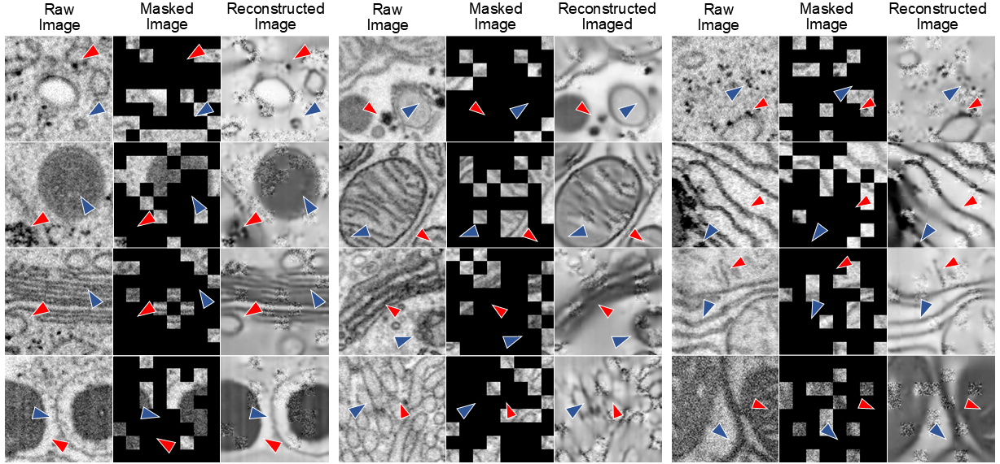

# OrgMIM

Datasets, codes, and pretrained weights for **“Masked Image Modeling for Generalizable Organelle Segmentation in Volume EM”** *(under review)*


## Table of Contents
- [1. Pretraining Database: IsoOrg-1K](#1-pretraining-database-isoorg-1k)
- [2. Downstream Segmentation Datasets](#2-downstream-segmentation-datasets)
- [3. Environments](#3-environments)
- [4. Organelle-specific Pretraining via OrgMIM](#4-organelle-specific-pretraining-via-orgmim)
- [5. Downstream Finetuning](#5-downstream-finetuning)
- [6. Visualization](#6-visualization)
- [7. Released Weights](#7-released-weights)
- [8. Acknowledgements](#8-acknowledgements)
- [Contact Us](#contact-us)
- 
## 1. Pretraining Database: IsoOrg-1K

We introduce **IsoOrg-1K**, a diverse organelle-specific dataset collected from [OpenOrganelle](https://openorganelle.janelia.org/). Detailed information is shown below. The full dataset (and the metadata) can be accessed [here](https://drive.google.com/drive/folders/13ybWYaCtwuRcRfhyEZ-_mY8fVUBFgGKS?usp=sharing), and the precomputed membrane maps are available [here](https://huggingface.co/datasets/yanchaoz/OrgMIM-datasets/tree/main).
Meanwhile, we are actively curating and integrating organelle datasets, and will continue to update this repository to support larger-scale pretraining in the future.


## 2. Downstream Segmentation Datasets

We conduct extensive experiments on six representative datasets with varying voxel resolutions and biological contexts. The processed and partitioned data can be downloaded from [here](https://huggingface.co/datasets/yanchaoz/OrgMIM-datasets/tree/main).

## 3. Environments

The complete Conda environment has been packaged for direct use. You can download and unzip it from [here](https://huggingface.co/yanchaoz/OrgMIM-models/tree/main).

## 4. Organelle-specific Pretraining via OrgMIM
### 4.1 Generation of membrane attention maps
The formalized description can be seen in 'preparation/MAM_details.png'.

#### Step 1. Loading a visual foundation model (SAM as an example)
First, install the [Segment Anything](https://github.com/facebookresearch/segment-anything) package:

```bash
pip install git+https://github.com/facebookresearch/segment-anything.git
```
Then, load the SAM model and weights in Python:
```python
from segment_anything import sam_model_registry, SamPredictor

# Available model types: "vit_h", "vit_l", "vit_b"
model_type = "vit_h"
checkpoint_path = "sam_vit_h_4b8939.pth"

# Download the checkpoint from the official GitHub:
# https://github.com/facebookresearch/segment-anything#model-checkpoints

sam = sam_model_registry[model_type](checkpoint=checkpoint_path)

```
In addition to SAM, models from the DINO family can also provide relevant priors. However, according to our qualitative experiments (see Figures/pca.png), their performance on EM data is not yet on par with that of SAM.
#### Step 2. Embedding-level similarity measurement
```python
# Load a single-channel TIFF image and convert it to 3-channel RGB
img = tiff[i, :, :]
img_rgb = np.stack([img] * 3, axis=0)  # Shape: (3, H, W)
image = np.transpose(img_rgb, (1, 2, 0))  # Shape: (H, W, 3)

# Initialize SAM predictor and extract features
predictor = SamPredictor(sam)
predictor.set_image(image)
embedding = predictor.features
embedding = embedding.detach().cpu().numpy().squeeze()  # Shape: (C, H, W)

# Compute pixel affinities from embeddings
affs = embeddings_to_affinities(embedding, delta_v=0.5, delta_d=1.5)
mam = np.minimum(affs[0], affs[1])  # Take element-wise min of first two channels
mam = mam[1:, 1:]

# Resize to desired shape
mam_resized = nearest_neighbor_resize(mam, (512, 512))

# Convert to uint8 format for saving or visualization
mam_uint8 = np.uint8(255 * mam_resize)
```

| Function / Class             | Defined In           | Description                                      |
|-----------------------------|----------------------|--------------------------------------------------|
| `embeddings_to_affinities`  | `preparation/mam_utils.py`  | Converts pixel embeddings into affinity maps     |
| `nearest_neighbor_resize`   | `preparation/mam_utils.py`     | Resizes 2D arrays using nearest neighbor interpolation |

### 4.2 Dual-branch masked image modeling

After downloading and preparing the pretraining dataset, OrgMIM pretraining can be launched using the following command:

```bash
python scripts/pretrain.py -c orgmim
```

All major experimental settings are specified in a unified configuration file (`scripts/config/orgmim.yaml`), including:

- **Backbone architecture**: ViT or CNN  
- **Model scale**: small / base / large  
- **Training hyperparameters**: masking ratio, etc.

## 5. Downstream Finetuning

Processed downstream datasets are available [here](https://huggingface.co/datasets/yanchaoz/IsoOrg-1K). Notably, the input data are normalized by dividing pixel intensities by **255.0**. The current implementation supports automatic downloading and loading of pretrained OrgMIM weights with different backbone architectures and model scales through a unified configuration file.
```bash
python scripts/finetune.py -c orgmim
```
We note that this repository does not provide task-specific training pipelines, but focuses on releasing pretrained weights with example code for network initialization.


## 6. Visualization
### Mask reconstruction by directly loading the pretrained MIM learner
```python
model = ViT(
    image_size=128,
    frames=128, 
    image_patch_size=16,  
    frame_patch_size=16, 
    channels=1,
    dim=768,
    depth=12,
    heads=12,
    mlp_dim=3072,
    dropout=0.1,
    emb_dropout=0.1
)

learner = MAE(
    encoder=model,
    masking_ratio=0.75,
    decoder_dim=512,
    decoder_depth=6,
)

ckpt_path_list = ['/***/***/orgmim_mae_b_learner.ckpt']
img_path = '/opt/data/.../input/image.tif'
att_path = '/opt/data/.../input/mam.tif'
save_dir = '/opt/data/.../output'
name_list = ['dual']

reconstruct_and_visualize(
    learner=learner,
    ckpt_paths=ckpt_path_list,
    img=img,
    att=mam,
    device=device,
    save_dir=save_dir,
    name_list=name_list,
    mask_ratio=0.75,
    step=200000,
    total_step=400000,
    patch_size=16,
    image_size=128,
    alpha_t=1
)
```
    
| Function / Class             | Defined In           | Description                                      |
|-----------------------------|----------------------|--------------------------------------------------|
| `reconstruct_and_visualize`   | `legacy/orgmim_mae/visualize.py`     | Load pretrained weights and reconstruct the masked input |


## 7. Released Weights

| Methods                   | Models                        | Download                                                      |
|----------------------------|-------------------------------|---------------------------------------------------------------|
| MAE-based OrgMIM (Base)    | orgmim_mae_b_learner.ckpt     | [Hugging Face](https://huggingface.co/yanchaoz/OrgMIM-models/tree/main)       |
| Spark-based OrgMIM (Base)  | orgmim_spark_b_learner.ckpt   | [Hugging Face](https://huggingface.co/yanchaoz/OrgMIM-models/tree/main)       |
| MAE-based OrgMIM (Large)   | orgmim_mae_l_learner.ckpt     | [Hugging Face](https://huggingface.co/yanchaoz/OrgMIM-models/tree/main)       |
| Spark-based OrgMIM (Large) | orgmim_spark_l_learner.ckpt   | [Hugging Face](https://huggingface.co/yanchaoz/OrgMIM-models/tree/main)       |
| MAE-based OrgMIM (Small)    | orgmim_mae_s_learner.ckpt     | [Hugging Face](https://huggingface.co/yanchaoz/OrgMIM-models/tree/main)       |
| Spark-based OrgMIM (Small)  | orgmim_spark_s_learner.ckpt   | [Hugging Face](https://huggingface.co/yanchaoz/OrgMIM-models/tree/main)       |

## 8. Acknowledgements

We sincerely thank all contributors and the providers of open-source datasets that supported this project, including:

- [OpenOrganelle](https://openorganelle.janelia.org/)  
- [CellMap Challenge](https://cellmapchallenge.janelia.org/)  
- [Lucchi++](https://sites.google.com/view/connectomics/)  
- [ASEM](https://github.com/kirchhausenlab/incasem)  
- [MitoEM](https://mitoem.grand-challenge.org/)  
- [BetaSeg](https://cloud.mpi-cbg.de/index.php/s/UJopHTRuh6f4wR8)

## Contact Us

If you have any questions or suggestions, feel free to contact us via email or by opening an issue.


